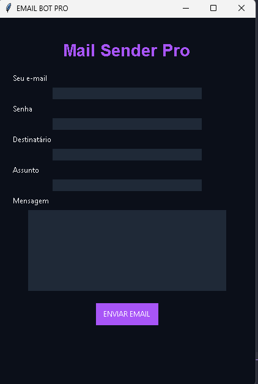

Sistema em Python com interface gráfica (Tkinter) que permite enviar e-mails automaticamente utilizando o servidor SMTP do Gmail.

---

## 🚀 Demonstração

---

## ⚙️ Funcionalidades

- Envio de e-mails via SMTP (Gmail)
- Interface gráfica simples e funcional
- Campo para remetente, senha, destinatário, assunto e mensagem
- Feedback de status em tempo real (sucesso ou erro)

---

## 🧠 Como funciona

O programa utiliza a biblioteca `smtplib` para se conectar ao servidor SMTP do Gmail e enviar e-mails com base nas informações inseridas na interface gráfica. A mensagem é montada usando `email.mime.text`.

---

## 🛠️ Tecnologias utilizadas

- Python 3
- Tkinter
- smtplib
- email.mime.text

---
Melhorias futuras
Histórico de e-mails enviados
Salvamento em banco de dados (SQLite)
Versão web com Flask
Interface mais moderna (CustomTkinter / PyQt)

👨‍💻 Autor

Desenvolvido por Adriano Lucas
Projeto focado em aprendizado de Python, automação e interfaces gráficas.

